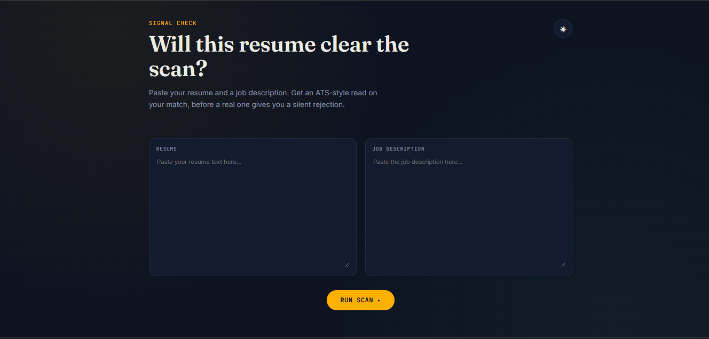
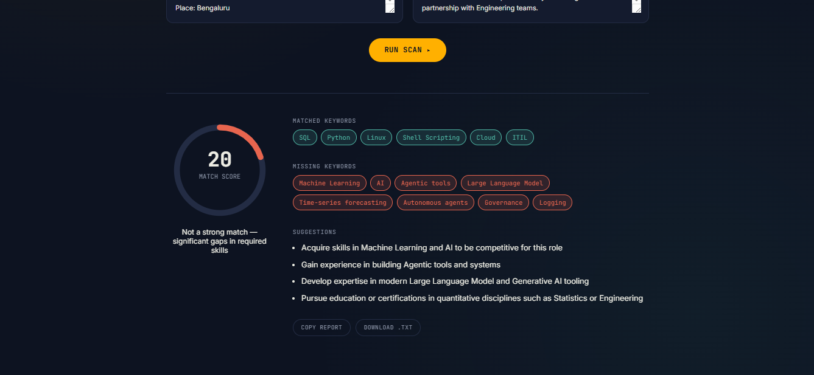

# 🚀 Resume Signal Scanner AI

An AI-powered Resume ATS Scanner that analyzes your resume against a job description and provides an ATS-style match score, missing keywords, and actionable suggestions to improve your chances of getting shortlisted.

---

## 📸 Preview

> Add screenshots of your application here.

| Home | Results |
|------|----------|
|  |  |

---

# ✨ Features

- 🎯 ATS Resume Match Score
- 🤖 AI-powered Resume Analysis
- 📊 Animated Match Gauge
- 🔍 Missing Keywords Detection
- ✅ Matched Skills Highlighting
- 💡 AI Resume Improvement Suggestions
- 🌙 Dark / Light Theme
- 📋 Copy Report
- 📥 Download Report
- 🕒 Scan History
- ⚡ Beautiful Animated UI
- 📱 Responsive Design

---

# 🛠 Tech Stack

### Frontend

- Next.js 15
- React
- CSS3
- JavaScript

### Backend

- Next.js API Routes

### AI

- Groq API
- Llama 3 Model

### Deployment

- Vercel

---

# 📂 Project Structure

```
resume-scanner/
│
├── app/
│   ├── api/
│   │   └── scan/
│   ├── globals.css
│   ├── layout.jsx
│   └── page.jsx
│
├── public/
│
├── package.json
├── next.config.js
├── jsconfig.json
├── README.md
└── .gitignore
```

---

# ⚙️ Installation

Clone the repository

```bash
git clone https://github.com/suman-cell/resume-scanner2.git
```

Go into the project

```bash
cd resume-scanner2
```

Install dependencies

```bash
npm install
```

---

# 🔑 Environment Variables

Create a file named

```
.env.local
```

Add your Groq API key

```env
GROQ_API_KEY=your_groq_api_key_here
```

You can get a free API key from:

https://console.groq.com/

---

# ▶️ Run the Project

Start the development server

```bash
npm run dev
```

Open your browser

```
http://localhost:3000
```

---

# 🚀 Production Build

Build the application

```bash
npm run build
```

Run production server

```bash
npm start
```

---

# ☁️ Deploy on Vercel

1. Push the project to GitHub
2. Import the repository into Vercel
3. Add the environment variable

```
GROQ_API_KEY
```

4. Click **Deploy**

---

# 📖 How It Works

1. Paste your Resume.
2. Paste the Job Description.
3. Click **Run Scan**.
4. The AI analyzes both documents.
5. It calculates an ATS Match Score.
6. Displays matched keywords.
7. Highlights missing keywords.
8. Generates personalized improvement suggestions.

---

# 📸 Screenshots

## Home Page

_Add screenshot here_

---

## Scan Result

_Add screenshot here_

---

## Dark Mode

_Add screenshot here_

---

# 📈 Future Improvements

- PDF Resume Upload
- DOCX Resume Upload
- AI Resume Rewrite
- AI Cover Letter Generator
- Resume Version History
- Authentication
- Dashboard Analytics
- Export PDF Report
- Multi-language Support
- Premium Resume Templates

---

# 🤝 Contributing

Contributions are welcome!

1. Fork the repository
2. Create a feature branch

```bash
git checkout -b feature-name
```

3. Commit changes

```bash
git commit -m "Added new feature"
```

4. Push

```bash
git push origin feature-name
```

5. Open a Pull Request

---

# 🐛 Issues

If you find any bugs or have feature requests, please open an issue on GitHub.

---

# 👨‍💻 Author

**Suman Kumar**

GitHub:
https://github.com/suman-cell

---

# ⭐ Support

If you found this project helpful, please give it a ⭐ on GitHub!

It motivates me to build more open-source AI projects.

---

## 📄 License

This project is licensed under the MIT License.
